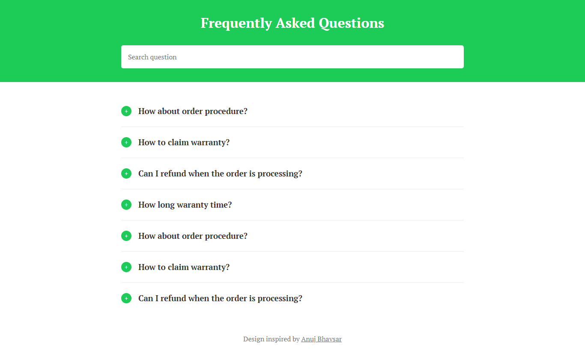

# vue-faq-starter

A starter faq page that build with Vue

<p class="text-align:center">
  
</p>

## Project setup
```
yarn install
```

### Compiles and hot-reloads for development
```
yarn serve
```

### Compiles and minifies for production
```
yarn build
```

### Lints and fixes files
```
yarn lint
```

### Data Configuration
**vue-faq-starter** data using **My JSON Server** by [Typicode](https://github.com/typicode).

You can costumize the data in the ``db.json`` file.

The ``db.json`` file will work if you fork this repository and now you can access your data server via
```
https://my-json-server.typicode.com/your-username/your-repo/ 
```

After that, change the data url inside ``App.vue`` file to your new data url.
```js
created() {
  fetch("https://my-json-server.typicode.com/your-username/your-repo")
  ...
},
```


### Customize configuration
See [Configuration Reference](https://cli.vuejs.org/config/).
